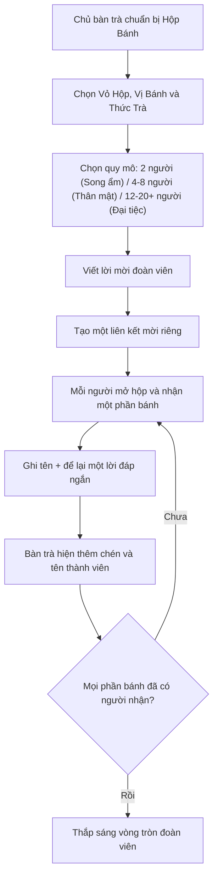
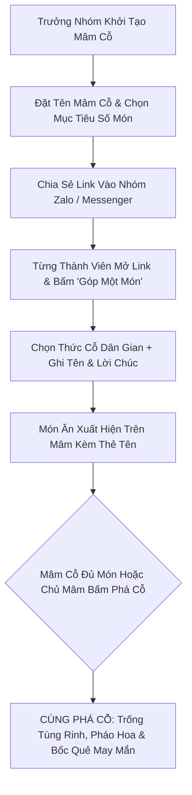

# ĐỀ ÁN Ý TƯỞNG: TRUNG THU ĐOÀN VIÊN - KẾT NỐI TÌNH THÂN

> [!NOTE]
> Tài liệu này chuẩn hóa và làm sâu sắc 2 tính năng trọng tâm mang đậm bản sắc văn hóa Tết Trung Thu Việt Nam, lấy **sự gắn kết giữa người với người (Human Connection)** làm linh hồn trải nghiệm:
> 1. **Bánh Trăng Đoàn Viên:** Một người chuẩn bị hộp bánh chung và mời một nhóm người thân cùng chia bánh, thưởng trà, đáp lời.
> 2. **Góp Cỗ Trông Trăng - Cùng Nhau Phá Cỗ:** Tính năng cộng đồng / nhóm bạn bè cùng chung tay chuẩn bị một mâm cỗ rực rỡ và cùng phá cỗ đêm rằm.

---

## Ý TƯỞNG 1: BÁNH TRĂNG ĐOÀN VIÊN (Mời Bánh Thưởng Trà)
*(Một người mở lời mời, nhiều người thân cùng chia một chiếc bánh và quây quần bên một bàn trà riêng)*

### 1.1. Triết Lý & Bối Cảnh Văn Hóa
Người Việt Nam vào dịp Rằm tháng Tám thường cùng nhau cắt một chiếc bánh tròn, rót trà và chuyện trò. Hình tròn của bánh và vầng trăng gợi sự viên mãn, sum họp. Vì vậy, trải nghiệm số không nên dừng ở việc một người gửi một món quà cho một người khác. **Một hộp bánh được mở ra để nhiều người cùng nhận phần, để lại lời đáp và tạo thành một vòng tròn đoàn viên.**

Không gian này hoạt động bằng liên kết mời riêng. Nó dành cho gia đình, nhóm bạn hoặc những người có quan hệ với nhau; không đưa lời nhắn lên khu vực công khai.

---

### 1.2. Trải Nghiệm Của Chủ Bàn Trà (Chuẩn Bị Hộp Bánh)
* **Bước 1 - Chọn vỏ hộp bánh truyền thống:**
  * *Hộp Mây Tre Đan:* Mộc mạc, gần gũi, thắt dây cói mộc.
  * *Hộp Sơn Mài Hoa Sen:* Sang trọng, quý phái dành tặng bố mẹ, cấp trên, thầy cô.
  * *Hộp Giấy Báo Cũ Thời Bao Cấp:* Hoài niệm, cảm giác thân thương của những mùa Trung Thu xưa.
* **Bước 2 - Chọn vị bánh gửi gắm tâm ý:**
  * *Bánh nướng thập cẩm xá xíu lá chanh:* Đậm đà phong vị truyền thống, tượng trưng cho tình thân keo sơn.
  * *Bánh nướng đậu xanh trứng muối vàng ươm:* Tượng trưng cho trăng rằm viên mãn, chúc vạn sự như ý.
  * *Bánh dẻo hạt sen ướp hoa bưởi:* Hương thơm thanh tao, chúc bình an và thanh thản trong tâm hồn.
  * *Bánh dẻo cốm non bọc lá sen:* Đậm chất thu Hà Nội, nhẹ nhàng và ngọt ngào.
* **Bước 3 - Chọn thức trà mời bạn:**
  * *Trà Sen Tây Hồ:* Đậm đà, hương sen ngan ngát.
  * *Trà Hoa Cúc Mật Ong:* Dịu ngọt, ấm áp đêm thu.
* **Bước 4 - Chọn quy mô bàn trà (Linh hoạt mọi đối tượng):**
  * **2 người (Song Ẩm / Tâm tình 1 người):** Dành riêng cho Người yêu, Mẹ, Bạn thân, Tri kỷ. Không bị trống chỗ, 2 người đối ẩm trọn vẹn 100%.
  * **4 / 6 / 8 người (Thân mật):** Gia đình nhỏ, nhóm bạn thân cạ cứng.
  * **12 / 20+ người hoặc Tùy chỉnh (Đại tiệc đoàn viên):** Dành cho tập thể lớp học, đại gia đình, phòng ban công ty.
  * Đặt tên cho buổi gặp: *"Chỉ hai ta dưới trăng"*, *"Nhà mình đêm rằm"*, *"Hội lớp 12A3"*, *"Bàn trà phòng Thiết kế"*.
* **Bước 5 - Viết lời mời kẹp trong nắp hộp:**
  * Lời mời được trình bày như bức thư tay nếp gấp cài bên dưới nắp hộp quà.
* **Bước 6 - Tạo liên kết chung:**
  * Một liên kết được gửi cho toàn bộ nhóm (hoặc người thương). Mỗi người mở liên kết sẽ bước vào cùng một hộp bánh và cùng một bàn trà.

---

### 1.3. Trải Nghiệm Của Thành Viên (Nhận Phần Bánh & Đáp Lời)
* **Khoảnh khắc mở hộp:**
  * Khi mở liên kết, thành viên thấy một hộp quà đóng kín đề tên: *"[Tên chủ bàn] mời bạn về chung một bàn trà đêm rằm"*.
  * Bấm nút **"Mở Nắp Hộp"**: Nắp hộp trượt mở nhẹ nhàng.
  * Trước mắt hiện ra:
    * Chiếc đĩa gốm Bát Tràng men lam với chiếc bánh đã chia đúng số phần mà chủ bàn chọn.
    * Tách trà nóng nghi ngút làn khói mảnh lượn lờ.
    * Tấm thiệp viết tay mở ra ngay ngắn bên cạnh.
* **Nhận một phần bánh:**
  * Thành viên bấm **"Nhận một miếng bánh & Ngồi vào bàn trà"**.
  * Mỗi người chỉ nhận một phần trong cùng một hộp. Phần đã nhận mang tên người đó và không thể bị người khác lấy lại.
  * Nếu bàn đã đủ người, khách đến sau vẫn được xem khoảnh khắc đoàn viên nhưng không chiếm thêm phần bánh.
* **Đáp lời:**
  * Thành viên ghi tên và để lại một câu ngắn cho cả nhóm.
  * Hiệu ứng nhấc một miếng bánh, thêm một chén trà mới và phát tiếng chạm chén *"lanh canh"*.
  * Lời đáp xuất hiện quanh bàn trà, thay cho một danh sách bình luận khô cứng.
* **Khoảnh khắc đủ vòng:**
  * Khi mọi phần đã có chủ, chiếc bánh tròn phát sáng dưới vầng trăng, các chén trà cùng nâng lên và toàn bộ tên thành viên kết thành vòng tròn.
  * Cả nhóm có thể lưu một ảnh kỷ niệm của bàn trà hoàn chỉnh.

---

### 1.4. Quản Lý "Tủ Bánh Đoàn Viên" (Trang Profile)
* Một người có thể tạo nhiều hộp cho các vòng quan hệ khác nhau: gia đình, bạn thân, lớp học hoặc đồng nghiệp.
* Trang cá nhân chia thành hai khu vực:
  * **Bàn trà mình mở:** số phần đã nhận, những lời đáp mới và nút sao chép liên kết mời.
  * **Bàn trà mình tham gia:** phần bánh đã nhận, lời mời ban đầu và ảnh kỷ niệm khi bàn đủ người.
* Trạng thái mỗi hộp: `Đang mời 3/6` / `Đã đủ vòng đoàn viên` / `Đã lưu kỷ niệm`.

### 1.5. Ranh Giới Để Không Trùng Với Bầu Trời Lời Chúc
* **Bầu trời** là không gian công khai: một người thả một lời chúc để bất kỳ ai tình cờ khám phá.
* **Bánh Trăng Đoàn Viên** là không gian theo liên kết mời: một nhóm quen biết cùng chia một vật thể chung, mỗi người để lại lời đáp và có một chỗ cụ thể trên bàn.
* Lời đáp trong hộp bánh không tự động xuất hiện trên Bầu trời. Chỉ khi người viết chủ động chọn **"Thả lời này lên bầu trời chung"** thì nó mới trở thành lời chúc công khai.
* Giá trị chính của tính năng không nằm ở số lượng lời nhắn mà ở tiến trình chiếc bánh dần được chia, bàn trà dần đông và vòng tròn đoàn viên được hoàn thành.

### 1.6. Nguyên Tắc Dữ Liệu & Chống Chiếm Chỗ
* Mỗi hộp có một `boxId`, chủ hộp, số phần tối đa và trạng thái riêng.
* Mỗi tài khoản ẩn danh chỉ nhận được một phần trong một hộp; cùng người đó vẫn có thể tham gia hộp khác.
* Việc nhận phần phải dùng thao tác nguyên tử trên cơ sở dữ liệu để hai người không lấy cùng một chỗ.
* Chỉ chủ hộp được sửa lời mời hoặc đóng bàn; mỗi thành viên chỉ sửa được tên và lời đáp của chính mình.
* Hộp bánh chỉ đọc được qua liên kết mời; không xuất hiện trong danh sách công khai hoặc kết quả tìm kiếm.

---
---

## Ý TƯỞNG 2: GÓP CỖ TRÔNG TRĂNG - CÙNG NHAU PHÁ CỖ
*(Tính năng kết nối nhóm tập thể: Gia đình, Lớp học, Nhóm bạn thân, Phòng ban công ty)*

### 2.1. Triết Lý & Ý Nghĩa Gắn Kết
"Phá cỗ" là hoạt động mang tính cộng đồng cao nhất của Tết Trung Thu Việt Nam. Một mâm cỗ đẹp không phải do một người tự mua, mà là **mỗi người một tay góp một thức quả**: người gọt bưởi làm chú chó bưởi, người mang nải chuối tiêu, người xếp đĩa hồng đỏ, người cắm chiếc đèn ông sao. Khi cùng nhau hoàn thành mâm cỗ, khoảnh khắc cùng nhau "phá cỗ" mới thực sự vỡ òa niềm vui.

---

### 2.2. Trải Nghiệm Chi Tiết

#### Bước 1: Khởi Tạo Mâm Cỗ (Tạo Không Gian Chung)
* Bất kỳ ai cũng có thể làm "Chủ mâm" bằng cách bấm **"Tạo Mâm Cỗ Đoàn Viên"**.
* Thiết lập đơn giản:
  * Đặt tên mâm cỗ (Ví dụ: *"Mâm cỗ Lớp 12A3"*, *"Mâm cỗ Đại gia đình Nhà Ngoại"*, *"Mâm cỗ Xóm Trọ 502"*).
  * Chọn kiểu mâm: *Mâm đồng cổ truyền* hoặc *Mẹt tre lót lá chuối xanh*.
  * Chọn mục tiêu phá cỗ: Góp đủ 5 món, 8 món, hoặc 12 món.

#### Bước 2: Chia Sẻ Link Vào Nhóm
* Hệ thống sinh ra một đường dẫn đặc biệt: `trungthu.vn/mam-co/[ma-mam-co]`.
* Chủ mâm gửi link vào nhóm bạn bè, người thân để rủ rê mọi người vào "góp cỗ".

#### Bước 3: Thành Viên Tham Gia "Góp Cỗ"
* Khi một người bạn bấm vào link:
  * Sẽ thấy chiếc mâm đồng/mẹt tre đang dần được lấp đầy bởi các món bạn bè trước đó đã góp.
  * Bấm nút **"Góp một món vào mâm"**.
  * Danh sách các thức cỗ dân gian Việt Nam để chọn (không trùng lặp hoặc được xếp cạnh nhau):
    1. **Chú chó bưởi lông xù mắt hạt nhãn:** Biểu tượng truyền đời của mâm cỗ Trung Thu Việt.
    2. **Nải chuối tiêu chín trứng cuốc:** Dáng quả cong như bàn tay nâng đỡ mâm ngũ quả.
    3. **Đĩa hồng đỏ mọng & quả na mở mắt:** Sắc đỏ may mắn và hương thơm nồng nàn mùa thu.
    4. **Gói cốm non lá sen buộc rơm vàng:** Món quà thanh khiết của đồng quê.
    5. **Cặp bánh nướng bánh dẻo ngũ phúc:** Điểm nhấn trang trọng giữa mâm.
    6. **Đèn ông sao 5 cánh giấy kính viền tua rua:** Cắm cao vút thắp sáng cả mâm cỗ.
    7. **Đĩa thị chín vàng thơm nức:** Hương thơm cổ tích bước ra từ truyện Tấm Cám.
  * Người góp nhập: **Tên của mình** + **Một lời chúc gửi đến cả nhóm**.

#### Bước 4: Mâm Cỗ Đầy Đặn Lên Trực Quan
* Món đồ vừa góp sẽ xuất hiện sống động ngay trên mâm cỗ kèm một thẻ tên nhỏ xinh đính bên cạnh (Ví dụ: *"Lan góp Chó bưởi"*, *"Huy góp Đèn ông sao"*).
* Khi rê chuột hoặc chạm vào món đồ, lời chúc của người đó sẽ hiện lên ấm áp.
* Thanh tiến trình hiển thị rõ: *"Mâm cỗ đã hoàn thành 7/8 món - Sắp đến giờ phá cỗ!"*.

#### Bước 5: Đại Lễ "CÙNG NHAU PHÁ CỖ"
* **Kích hoạt:** Khi đủ 100% mục tiêu, hoặc khi Chủ mâm quyết định bấm nút **"Phá Cỗ Trông Trăng"**.
* **Hiệu ứng bùng nổ:**
  * Màn hình chuyển sang khung cảnh đêm trăng rực sáng với tiếng trống múa lân *"Tùng... cheng... tùng rinh rinh"* rộn ràng.
  * Mâm cỗ tỏa sáng rực rỡ, pháo hoa giấy ngũ sắc bay lượn.
  * **Phần thưởng may mắn cho từng thành viên:**
    * Mỗi người tham gia bấm vào một món trên mâm cỗ để nhận một **"Quẻ Lộc Mùa Trăng"** (những lời tiên tri hài hước, may mắn về thi cử, công việc, tình duyên).
  * **Lưu giữ kỷ niệm:** Nút **"Chụp ảnh kỷ niệm mâm cỗ"** để tải về bức tranh mâm cỗ hoàn chỉnh có đầy đủ tên của tất cả thành viên trong nhóm làm kỷ niệm.

---

## 3. BẢNG PHÂN VAI 3 TRẢI NGHIỆM

| Tiêu Chí | Bầu Trời Lời Chúc | Bánh Trăng Đoàn Viên | Góp Cỗ & Cùng Phá Cỗ |
| :--- | :--- | :--- | :--- |
| **Mô hình tương tác** | Một người với cộng đồng công khai | Một người mời một nhóm quen biết cùng chia bánh | Cả nhóm cùng đóng góp để hoàn thành một mâm cỗ |
| **Hành động trung tâm** | Thả và khám phá lời chúc | Nhận một phần bánh, ngồi vào bàn và đáp lời | Mỗi người góp một món rồi cùng phá cỗ |
| **Vật thể chung** | Bầu trời có các ngọn đèn độc lập | Một chiếc bánh tròn và một bàn trà chung | Một mâm cỗ được nhiều người cùng hoàn thiện |
| **Phạm vi** | Công khai | Riêng theo liên kết mời | Nhóm theo liên kết mời |
| **Điều tạo cảm xúc** | Bất ngờ từ một người chưa biết | Nhìn vòng tròn người thân dần đầy lên | Cảm giác cùng làm, cùng chờ và cùng ăn mừng |
| **Dấu mốc hoàn thành** | Mỗi lời chúc tự đứng độc lập | Tất cả phần bánh đã có người nhận | Đủ mục tiêu số món hoặc chủ mâm mở lễ phá cỗ |
| **Đối tượng lý tưởng** | Cộng đồng, khách ghé trang | Gia đình, nhóm bạn thân, đồng nghiệp gần gũi | Lớp học, đại gia đình, câu lạc bộ, phòng ban |
| **Tính lan tỏa** | Người nhận tiếp tục thả lời tốt đẹp | Chủ bàn mời 4–8 người về chung một bàn | Mỗi thành viên rủ thêm người góp đủ mâm |

---

## 4. HỆ SINH THÁI KẾT NỐI HOÀN CHỈNH

Ba trải nghiệm tạo thành ba cấp độ quan hệ, không cạnh tranh với nhau:

1. **Gặp nhau dưới bầu trời:** đọc một lời chúc từ cộng đồng và cảm nhận sự tử tế bất ngờ.
2. **Mời nhau về bàn trà:** chọn những người mình quý để cùng chia một chiếc Bánh Trăng Đoàn Viên.
3. **Cùng nhau dựng hội:** mỗi thành viên góp một phần để hoàn thành Mâm Cỗ Trông Trăng.

Trong điều hướng website, ba lời kêu gọi hành động nên dùng động từ khác nhau:

* **Bầu trời:** “Thả một lời dưới trăng”.
* **Bánh đoàn viên:** “Mời người thương về bàn trà”.
* **Mâm cỗ:** “Rủ mọi người cùng góp cỗ”.

---

## 5. DANH SÁCH TÀI NGUYÊN ĐỒ HỌA CẦN THIẾT KẾ (DÀNH CHO IMAGE AGENT)

> [!IMPORTANT]
> Toàn bộ hình ảnh cần được xuất dưới định dạng **WebP** hoặc **PNG trong suốt (Transparent background)**, phong cách vẽ minh họa tranh dân gian Việt Nam pha chút chất màu nước hiện đại, tông màu ấm cúng (vàng trăng, nâu ấm, men lam Bát Tràng, đỏ son).

### 5.1. Bộ Vỏ Hộp Bánh Trung Thu (Kích thước đề xuất: 800 x 800px, góc nhìn phối cảnh 3/4 hoặc chính diện)
1. `box-bamboo.webp`: Hộp mây tre đan thủ công, nan tre mộc mạc, thắt dây cói nơ mộc, lót lá sen tươi.
2. `box-lacquer.webp`: Hộp gỗ sơn mài cao cấp, tông đỏ mận/đỏ đô bóng mờ, vẽ hoa sen dát vàng hoàng gia.
3. `box-paper.webp`: Hộp bánh giấy báo cổ thời bao cấp, buộc lạt tre, dán tem chữ đỏ hoài niệm Tết Trung Thu xưa.

### 5.2. Bộ Bánh Trung Thu & Đĩa Trà (Kích thước đề xuất: 600 x 600px, Top-down view nhìn từ trên xuống)
1. `mooncake-full.webp`: Chiếc bánh nướng vàng ruộm bóng mật ong, hoa văn sen nổi khối, chữ "Đoàn Viên" ở giữa.
2. `mooncake-cut-2.webp`: Chiếc bánh được chia đôi làm 2 nửa tinh tế (dành riêng cho chế độ Song Ẩm 2 người).
3. `mooncake-cut-4.webp`: Chiếc bánh cắt 4 góc vuông vức, để lộ nhân thập cẩm / đậu xanh trứng muối vàng ươm.
4. `tea-table-platter.webp`: Đĩa sứ gốm Bát Tràng men lam cổ kính (dùng làm nền đặt bánh).

### 5.3. Bộ Chén Trà & Thức Uống (Kích thước đề xuất: 300 x 300px, Top-down view)
1. `cup-empty.webp`: Chén gốm men rạn Bát Tràng rỗng, chờ người thân vào ngồi.
2. `cup-filled.webp`: Chén trà sen nước vàng sóng sánh, có làn khói mờ ảo bốc lên nhẹ nhàng.
3. `teapot.webp`: Ấm trà gốm men lam đồng bộ.

### 5.4. Bộ Vật Phẩm Mâm Cỗ Trông Trăng (Kích thước đề xuất: 400 x 400px, Transparent)
1. `item-cho-buoi.webp`: Chú chó bưởi lông xù mắt hạt nhãn, cổ thắt nơ đỏ.
2. `item-nai-chuoi.webp`: Nải chuối tiêu chín trứng cuốc cong cong ôm đỡ mâm ngũ quả.
3. `item-hong-na.webp`: Đĩa quả hồng đỏ thắm và na dai mở mắt thơm nức.
4. `item-com-vong.webp`: Gói cốm non bọc lá sen tươi, buộc sợi rơm vàng nếp cái hoa vàng.
5. `item-den-ong-sao.webp`: Chiếc đèn ông sao 5 cánh bọc giấy kính bóng đỏ, viền tua rua ngũ sắc.

